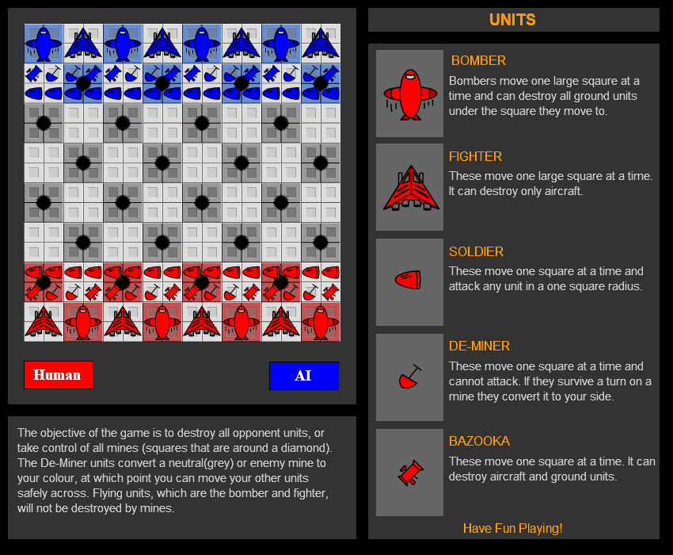

# Military TBS Game

A Macromedia Flash 8 game to try out mechanics similar to chess and maybe eventually advance wars/fire emblem.

## Gameplay
The controls and win states are given in game and in the screenshot, replicated here so its in text form.

### Objective
The objective of the game is to destroy all opponent units, or take control of all the mines (squares that are around a diamond). De-Miner units convert a neutral (grey) or opponent mine to your color, at which point you can move your other units safely accross. Flying units, which are the Bomber and Fighter, will not be destroyed by mines.

Select a piece with with the mouse and drag to place. All units move 1 space of the same size. Land units are a single small tile, Air units are a 2x2 large tile.

### Units
| Name     | Description |
| -------- | --- |
| Bomber   | Moves one large square at a time and destroys aground units under them |
| Fighter  | Moves one large square at a time and destroys air units |
| Soldier  | Moves one square at a time and attacks any ground units |
| De-Miner | Moves one square at a time and cannot attack. They convert the mine they are standing on at the start of the turn. |
| Bazooka  | Moves one square at a time and attacks all unit types |

## Design Notes (Pre-Source Control)
Version 1.3.3
- AI could use some work. It needs to be tested with some one on one games. I'm thinking of adding multiple difficulties by structuring the AI and expanding it. I'm thinking off layering it so that an individual unit knows what to go after, what it's strengths are. then make it decide which unit of the randomly chosen type is in the best position. then finally have it choose the best type of unit to move.

- The code could use some better structure. I should use some more classes for packaging unit types and a sides units. This may also make the above ai improvements simpler.
	
- Another update to the graphics would be in order, though this simple version is easy for testing, and I want to keep them easily identifiable.
	
- A point was made about unit movement range. That would complicate the AI a bit but I can see where some units could benefit. I'm thinking soldiers could use an extra square to give them some actual tactical bite over the granadiers. Possibly the fighers but they don't kill anything but bombers anyway so I'm unsure.

- Add automatic movement to both sides and a delay between them to alllow simming. If I see some games play out I might be able to reevaluate the design.

### August 12, 2009
- Thinking about it now, It would almost be worth it for the chosen unit to have a weight of which unit is best to attack. so each unit type would have an affinity for attacking certain units, and then we would multiply or do some other scaling by distance to choose the best target to move toward. Then we take that further by evaluating each units best score and moving that one. though that may result in the cpu chasing down the user one unit at a time. using the weights on at least a per unit basis could be useful to make the unit flee a dangerous situation. or stay in place.

- Need to allow for human vs human games and eventually peer to peer or some form of online.

- I need to play against a human opponent so i can see strategies develop and see if the game itself is fun.The size of the grid may need to shrink.

### Version 1.3.4
- Deminers actually head toward opponent mines

### Version 1.3.5
- Code cleanup and restructuring. changed sides to be numeric instead of strings to allow indexing into the global unit array, which has also been added. large structural chanegs won't impact gameplay, but allow for simpler code and implementation of future code.

### Version 1.3.6
- Added ability to change whether a side is controller by a human or the ai.
- Moved AI execution into a setinterval when using ai vs ai because where it was caused too much recursion
- Can now begin to analyze patterns in the ai and notice any stupid moves it makes.