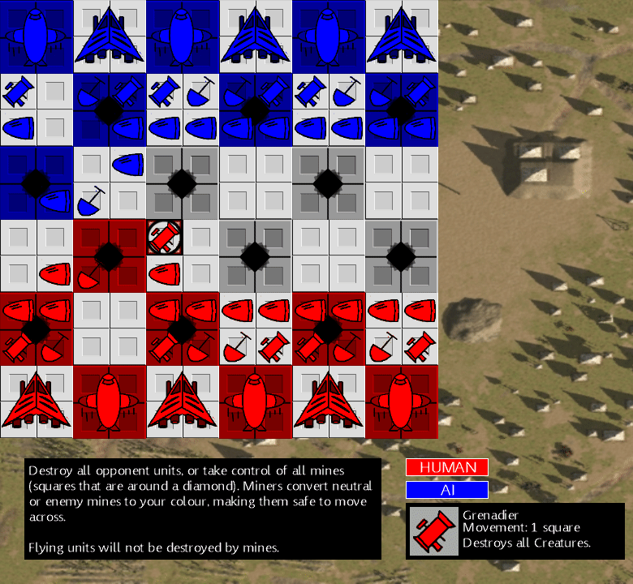

# Military TBS Game

A Microsoft XNA game to try out mechanics similar to chess and eventually advance wars/fire emblem.

This is a port/continuation of an old flash game. See [flash/README.md](flash/README.md) for the original version.

## Gameplay

The controls and win states are given in game and in the screenshot, replicated here so its in text form.

### Objective
The objective of the game is to destroy all opponent units, or take control of all the mines (squares that are around a diamond). De-Miner units convert a neutral (grey) or opponent mine to your color, at which point you can move your other units safely accross. Flying units, which are the Bomber and Fighter, will not be destroyed by mines.

### Controls

Select a piece with with the mouse and click in the highlighted area to move. All units move 1 space of the same size. Land units are a single small tile, Air units are a 2x2 large tile.

There's also gamepad support. Move the cursor with the dpad or analog and use B on a Xbox360 controller to select and move your pieces.

### Units
| Name     | Description |
| -------- | --- |
| Bomber   | Moves one large square at a time and destroys aground units under them |
| Fighter  | Moves one large square at a time and destroys air units |
| Soldier  | Moves one square at a time and attacks any ground units |
| De-Miner | Moves one square at a time and cannot attack. They convert the mine they are standing on at the start of the turn. |
| Bazooka  | Moves one square at a time and attacks all unit types |

## Editor

There's a basic form for editing the army layouts which are available, along with the UI system. This is very much in a half finished state. Several aspects still require manually editing text files in the content project.

